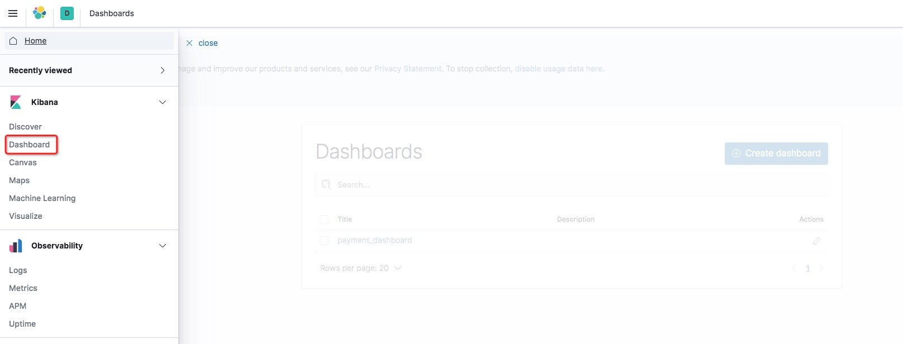
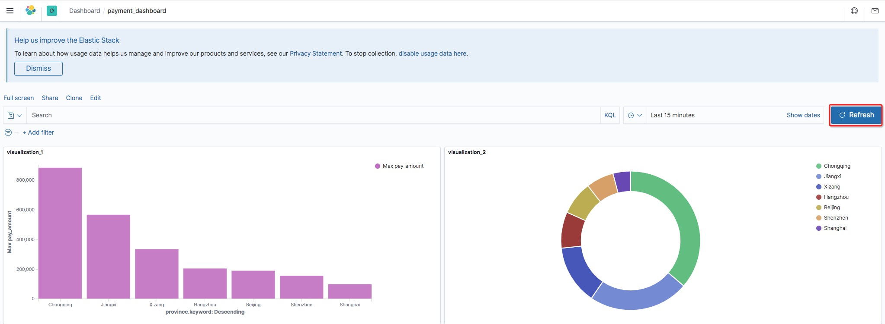
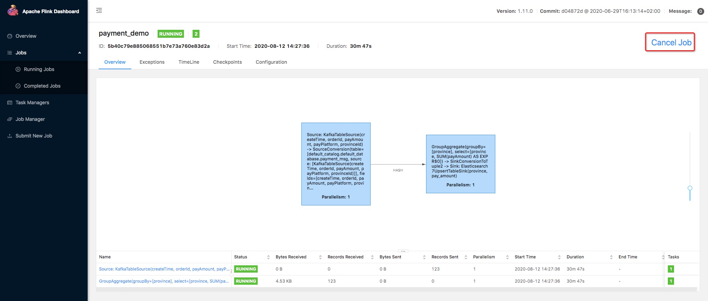

# pyflink-walkthrough

## Background

In this playground, you will learn how to build and run an end-to-end PyFlink pipeline for data analytics, covering the following steps:

* Reading data from a Kafka source;
* Creating data using a [UDF](https://ci.apache.org/projects/flink/flink-docs-release-1.11/dev/python/table-api-users-guide/udfs/python_udfs.html);
* Performing a simple aggregation over the source data;
* Writing the results to Elasticsearch and visualizing them in Kibana.

### Kafka
You will be using Kafka to store sample input data about payment transactions. A simple data generator [generate_source_data.py](generator/generate_source_data.py) is provided to
continuously write new records to the `payment_msg` Kafka topic. Each record is structured as follows:
 
`{"createTime": "2020-08-12 06:29:02", "orderId": 1597213797, "payAmount": 28306.44976403719, "payPlatform": 0, "provinceId": 4}`

* `createTime`: The creation time of the transaction. 
* `orderId`: The id of the current transaction.
* `payAmount`: The amount being paid with this transaction.
* `payPlatform`: The platform used to create this payment: pc or mobile.
* `provinceId`: The id of the province for the user. 

You can use the following command to read data from the Kafka topic and check whether it's generated correctly:
```shell script
$ docker-compose exec kafka kafka-console-consumer.sh --bootstrap-server kafka:9092 --topic payment_msg
{"createTime":"2020-07-27 09:25:32.77","orderId":1595841867217,"payAmount":7732.44,"payPlatform":0,"provinceId":3}
{"createTime":"2020-07-27 09:25:33.231","orderId":1595841867218,"payAmount":75774.05,"payPlatform":0,"provinceId":3}
{"createTime":"2020-07-27 09:25:33.72","orderId":1595841867219,"payAmount":65908.55,"payPlatform":0,"provinceId":0}
{"createTime":"2020-07-27 09:25:34.216","orderId":1595841867220,"payAmount":15341.11,"payPlatform":0,"provinceId":1}
{"createTime":"2020-07-27 09:25:34.698","orderId":1595841867221,"payAmount":37504.42,"payPlatform":0,"provinceId":0}
```
You can also create a new topic by executing the following command:
```shell script
$ docker-compose exec kafka kafka-topics.sh --bootstrap-server kafka:9092 --create --topic <YOUR-TOPIC-NAME> --partitions 8 --replication-factor 1
```

### PyFlink

The transaction data will be processed with PyFlink using the Python script [payment_msg_processing.py](payment_msg_proccessing.py).
This script will first map the `provinceId` in the input records to its corresponding province name using a Python UDF, 
and then compute the sum of the transaction amounts for each province. 

### ElasticSearch

ElasticSearch is used to store the upstream processing results and to provide an efficient query service.

### Kibana

Kibana is an open source data visualization dashboard for ElasticSearch. You will use it to visualize 
the results of your PyFlink pipeline.

## Setup

As mentioned, the environment for this walkthrough is based on Docker Compose; It uses a custom image
to spin up Flink (JobManager+TaskManager), Kafka+Zookeeper, the data generator, and Elasticsearch+Kibana
containers.

Your can find the [docker-compose.yaml](docker-compose.yml) file of the pyflink-walkthrough is located in the `pyflink-walkthrough` root directory.

### Building the Docker image

First, build the Docker image by running:

```bash
docker-compose build
```

### Starting the Playground

Once the Docker image build is complete, run the following command to start the playground:

```bash
docker-compose up -d
```

One way of checking if the playground was successfully started is to access some of the services that are exposed:

1. visiting Flink Web UI [http://localhost:8081](http://localhost:8081).
2. visiting Elasticsearch [http://localhost:9200](http://localhost:9200).
3. visiting Kibana [http://localhost:5601](http://localhost:5601).

**Note:** you may need to wait around 1 minute before all the services come up.

### Stopping the Playground

To stop the playground, run the following command:

```bash
docker-compose down
```


## Running the PyFlink job

1. Submit the PyFlink job.
```shell script
$ docker-compose exec jobmanager ./bin/flink run -py /opt/pyflink-walkthrough/payment_msg_proccessing.py -d
```

2. Navigate to the [Kibana UI](http://localhost:5601) and choose the pre-created dashboard `payment_dashboard`.





3. Stop the PyFlink job:

Visit the Flink Web UI at [http://localhost:8081/#/overview](http://localhost:8081/#/overview) , select the job and click `Cancel` on the upper right side.



## Further Explorations

If you would like to explore this example more deeply, you can edit [payment_msg_processing.py](payment_msg_proccessing.py)
or create new PyFlink projects that perform more complex processing. You can do this locally under
the `pyflink-walkthrough` directory, since it is mounted on the `jobmanager` docker container.

Ideas:
* Add your own Kafka source table;
* Create new index for the Elasticsearch sink;
* Count the number of transactions, grouped by a 1 minute tumbling windows and payPlatform.

After making a modification, you can submit the new job by executing the same command mentioned at 
[Running the PyFlink Job](#running-the-pyflink-job)
```shell script
$ docker-compose exec jobmanager ./bin/flink run -py /opt/pyflink-walkthrough/payment_msg_proccessing.py -d
```

Furthermore, you can also [create new kibana dashboards](https://www.elastic.co/guide/en/kibana/7.8/dashboard-create-new-dashboard.html) 
to visualize other aspects of the data in the Elasticsearch.